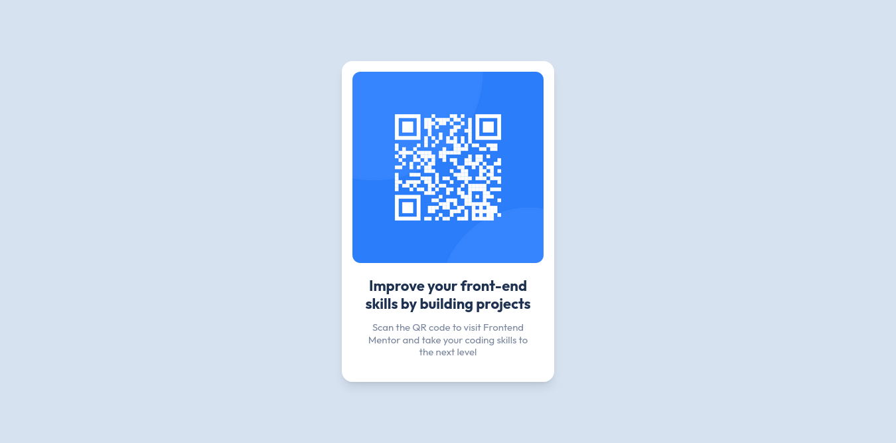

# Frontend Mentor - QR code component solution

This is a solution to the [QR code component challenge on Frontend Mentor](https://www.frontendmentor.io/challenges/qr-code-component-iux_sIO_H). Frontend Mentor challenges help you improve your coding skills by building realistic projects.

## Table of contents

- [Overview](#overview)
  - [Screenshot](#screenshot)
  - [Links](#links)
- [My process](#my-process)
  - [Built with](#built-with)
  - [What I learned](#what-i-learned)
  - [Continued development](#continued-development)
  - [Useful resources](#useful-resources)
- [Author](#author)
- [Acknowledgments](#acknowledgments)

## Overview

### Screenshot

#### Mobile version


#### Desktop version



### Links

- Solution URL: [Add solution URL here](https://your-solution-url.com)
- Live Site URL: [Add live site URL here](https://your-live-site-url.com)

## My process

### Built with

- Semantic HTML5 markup
- Tailwind CSS
- Flexbox
- EcmaScript 6
- Mobile-first workflow

### What I learned

How to use Tailwind classes to create responsive layouts without writing a single line of CSS file.

```html
<div
  class="flex flex-col p-4 mx-auto bg-white shadow-lg w-80 h-fit text-center rounded-2xl"
></div>
```

### Continued development

This is the first project in which I use Tailwind, I want to continue improving my knowledge in this framework.

### Useful resources

- [Tailwind documentation](https://tailwindcss.com/) - Tailwind's documentation is clear and complete, it's a great source of learning.

## Author

- GitHub - [devpatola](https://github.com/devpatola)
- Frontend Mentor - [@devpatola](https://www.frontendmentor.io/profile/devpatola)

## Acknowledgments

I was able to accomplish this challenge thanks to Professor Traversy's [Tailwind course](https://www.udemy.com/share/106DvQ3@X4DcYkcRO49zr6Ru-hCtnEOnDBQyghSSpkWuhI0L8P1gW68wD9EFdMhV4eSbeBC0Ng==/). I recommend it 100%.
